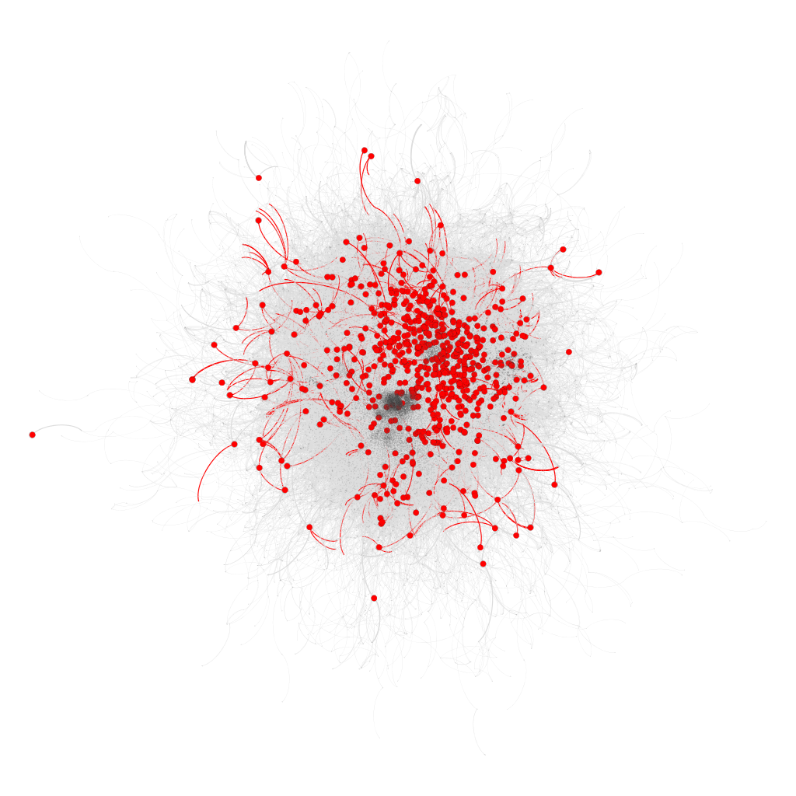

I had the opportunity to work on a project as a data analyst for a researcher at the Sinica Academia. The project focused on studying criminal networks and my role was to assist in the construction and analysis of a large social network. I was responsible for constructing and analyzing large social networks using Python and R, deriving insights from complex sets of data provided by the Coast Guard Administration. My work was instrumental in understanding the behaviors and tendencies within these networks, contributing valuable data to the field of criminology.

## Constructing and Analyzing Social Networks in Python

I was chiefly responsible for constructing the social network, a massive data amalgamation sourced from three different datasets provided by the Coast Guard Administration.

- **Collaboration and Behavior Analysis**: 
  - Researched the collaboration tendencies and behavior patterns of various groups within the network, including "good people," suspects, and criminals.
  - Utilized vertices' attributes and DID features to further segment and analyze these groups.
  - Conducted ANOVA analysis in Python to draw statistically significant conclusions.

Through these analyses, we gained a deeper understanding of the complex relationships and attributes that dictate behavior within criminal networks, providing a strong foundation for future research.

## Advanced Network Modeling with R

In addition to Python, I used R to delve even deeper into the intricate relationships within the social networks.

- **Exponential Random Graph Models**:
  - Created these models to dissect the inherent features that shape the criminal network.
  - Generated random graphs to measure the efficiencies and securities of active and criminal networks.

By comparing the attributes of these generated networks with the real-world data, we were able to more comprehensively understand the intricacies of criminal social structures.

## 

